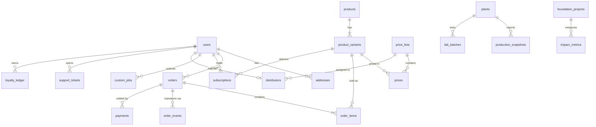

# Database

PostgreSQL 16 schema for the AQUOR platform. Validated against a live
PostgreSQL 16 instance (`schema.sql` then `seed.sql` apply cleanly).

```bash
createdb aquor
psql aquor < schema.sql
psql aquor < seed.sql
```

## Entity-relationship overview



## Design decisions

- **UUID keys** (`gen_random_uuid()`) so IDs can be generated client-side and
  merged across regions.
- **`orders` is range-partitioned by `placed_at`** — the partition key is part
  of the primary key, enabling monthly partitions + archival at scale
  (see docs/SCALABILITY.md). A `DEFAULT` partition keeps development friction-free.
- **Money as `numeric(12,2)`** with an explicit `currency` column — multi-currency
  from day one (NGN retail, USD export).
- **Enums for state machines** (`order_status`, `payment_status`,
  `custom_job_status`) — invalid states are unrepresentable.
- **`production_snapshots` and `lab_batches` are read models** fed by MES/SCADA
  and LIMS; the factory systems remain the source of truth.
- **`impact_metrics` uses `daterange` periods** so quarterly and annual
  aggregations don't require schema changes; `verified_by` records the auditor.
- **`audit_logs`** capture actor, entity, JSON diff and IP for NDPR/GDPR
  accountability.

## Migrations

Production migrations run via a migration tool (e.g. `node-pg-migrate` or
Prisma Migrate) with one file per change; `schema.sql` is the canonical
baseline (squash) for fresh environments.

## Backup & restore

- Nightly `pg_dump -Fc` to S3 with 35-day retention + WAL archiving for PITR.
- Quarterly restore drills into staging (documented, timed, sign-off required).
- `production_snapshots` and `audit_logs` excluded from logical dumps beyond
  90 days (archived to Parquet on S3).
