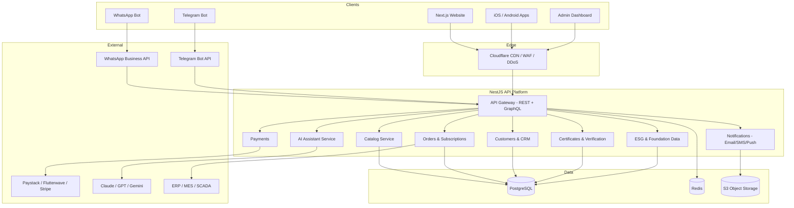

# Architecture

## System overview

## Frontend (implemented)

- **Framework**: Next.js 14 App Router, TypeScript strict, React Server Components.
- **Rendering**: every route is statically prerendered (SSG) for CDN-edge delivery;
  interactive islands hydrate via `"use client"` components only where needed
  (hero, counters, charts, dashboard, nav).
- **Animation**: Framer Motion for reveals/parallax/gestures; a dependency-free
  `<canvas>` water simulation for the hero (falls back to a static render under
  `prefers-reduced-motion`).
- **Styling**: Tailwind CSS with a token layer (`tailwind.config.ts`) — navy/ocean/aqua/gold
  ramps, glassmorphism utilities, motion keyframes.
- **SEO**: per-route metadata, JSON-LD (Organization, ItemList/Product, NGO, FAQPage),
  `sitemap.ts`, `robots.ts`, PWA `manifest.ts`, canonical URLs, OG/Twitter cards.
- **Security**: strict headers set in `next.config.mjs` (HSTS, frame-deny, nosniff,
  referrer & permissions policies).

## Backend (specification)

Modular NestJS monolith, split-ready along module seams (each module owns its
tables and events):

| Module | Responsibility |
|---|---|
| `catalog` | Products, variants, price lists, wholesale tiers |
| `orders` | Carts, orders, deliveries, subscriptions, custom-bottle jobs |
| `customers` | Accounts, segments, loyalty, distributor/supplier profiles |
| `payments` | PSP orchestration, invoices, refunds, multi-currency |
| `certificates` | Certificate registry + public verification endpoint |
| `esg` | Foundation projects, impact metrics, report publishing |
| `notifications` | Email/SMS/WhatsApp/Telegram/push fan-out |
| `ai` | Retrieval-augmented assistant over `ai/knowledge-base` |
| `integrations` | ERP, MES/SCADA read models, CRM sync |

Communication: REST for public APIs (documented in
[API_DOCUMENTATION.md](API_DOCUMENTATION.md)), GraphQL for portal/admin
aggregation, Redis pub/sub + outbox pattern for async events.

## Data

PostgreSQL is the system of record (schema in [`database/`](../database/)),
Redis handles sessions, rate limiting and hot caches, S3 stores media,
reports and certificates.

## Cross-cutting

- **AuthN/AuthZ**: Clerk or Auth.js (OIDC) + RBAC roles (`customer`, `distributor`,
  `supplier`, `staff`, `admin`, `auditor`); 2FA for staff/admin.
- **Observability**: OpenTelemetry traces → Prometheus/Grafana; Sentry for errors;
  structured JSON logs.
- **Deployment**: containers on Kubernetes (manifests in `infrastructure/k8s/`)
  or Vercel for the frontend; Terraform provisions cloud resources.
- **Scalability**: see [SCALABILITY.md](SCALABILITY.md) for the 10M+ user plan.
